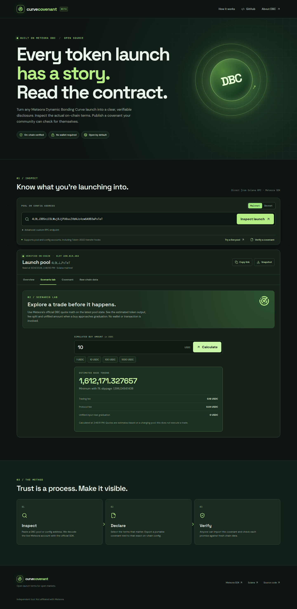

# Curve Covenant

**Live, human-readable terms for Meteora Dynamic Bonding Curve (DBC) launches.**

Curve Covenant reads a DBC pool or config directly from Solana using Meteora's official TypeScript SDK. It shows the initial trading fee, fee schedule, quote asset and graduation threshold, migration target, creator and partner fee and liquidity shares, token authority, and live pool progress. Its scenario lab uses Meteora's swap quote math to estimate a buy, fee split, and partial fill without sending a transaction. A launch team can export terms as a portable JSON covenant. Anyone can import that file later and compare each declared field against a fresh on-chain read.

This is an independent tool, not a Meteora product or financial advice.

## Try it

Open [the live site](https://furkanefecancaglar.github.io/curve-covenant/) and choose **Try a live pool**, or paste any Meteora DBC pool/config address. A wallet is not required. Use a custom RPC endpoint under **Advanced** if the shared public endpoint is rate limited.

Watch the [two-minute product demo](https://furkanefecancaglar.github.io/curve-covenant/demo.mp4) and [project presentation](https://furkanefecancaglar.github.io/curve-covenant/pitch.mp4). The demo reads a public sample pool; its token is unrelated to Curve Covenant.

### Embed the live report

After inspecting a pool, click **Copy embed**. The iframe opens a compact report that refreshes from chain whenever a visitor loads it:

```html
<iframe src="https://furkanefecancaglar.github.io/curve-covenant/?address=4L9LJ3B5niCSLWujRJjPU6scZVbNJz4zw6A9B3aPxTeT&network=mainnet-beta&embed=1" title="Curve Covenant DBC launch terms" width="100%" height="930" loading="lazy" style="border:0;border-radius:12px"></iframe>
```

Launchpads and terminals can embed a pool report without integrating a backend. The sample address is only a technical fixture; replace it with the launch's own pool.

The included sample pool is a live technical fixture, not an endorsement of its token. The [official DBC program](https://github.com/MeteoraAg/dynamic-bonding-curve-sdk) is `dbcij3LWUppWqq96dh6gJWwBifmcGfLSB5D4DuSMaqN`.

## Why this exists

DBC launchpads can configure fee schedules, graduation thresholds, post-migration liquidity distribution, token authority, and more. Those choices are visible on-chain but difficult for many people to interpret together. A reusable disclosure format lets launch teams publish precise terms and lets users verify them independently.

The app supports standard and transfer-hook variants of both DBC pools and configs through `DynamicBondingCurveClient.state`. Its scenario lab calls `DynamicBondingCurveClient.pool.swapQuote2` in partial-fill mode on fresh pool state. It uses exact integer arithmetic for raw quote token units and validates account ownership against the DBC program before decoding. It never asks users to sign a transaction.

## Run locally

```bash
npm ci
npm run dev
```

Run checks:

```bash
npm test
npm run build
```

Requires Node.js 22 or newer. The app is a static Vite/React site; all chain reads happen directly in the browser. Mainnet defaults to PublicNode because Solana's own shared mainnet RPC rejects many browser origins. Devnet uses Solana's public devnet RPC. Neither endpoint is hard-coded into a backend; users can supply their own RPC.

## Covenant format

Version `curve-covenant/v1` is a JSON object containing the network, config and optional pool address, project name, description, creation time, and selected claims. Comparison is exact for the selected decoded on-chain fields. If a claim differs from the current config, the UI shows both the declared and live values.

The optional signature uses Phantom's fee-free `signMessage()` method and Ed25519 verification. The signer must equal either the config's on-chain fee claimer or the pool's creator to receive a role-verified badge. An unsigned file or a valid signature from an unrelated wallet is shown separately. Signed data is domain-separated and includes every disclosed field, so changing a field invalidates the signature.

Anyone can create an unsigned covenant file. A signature proves that the listed wallet signed those bytes, not that the wallet's human owner is trustworthy or that future actions are guaranteed. Publishing through a recognized project channel provides additional context.

### Verify from a terminal

The CLI emits JSON and exits with code 1 if a claim fails, a signature is invalid, or a required role signature is missing. It reads current Solana state through the same decoder as the website:

```bash
npm run verify -- examples/public-sample-covenant.json
npm run verify -- path/to/issuer-covenant.json --require-role-signature
```

The included sample covenant is explicitly unsigned and serves only as a format and chain-reading example. Automation can consume the `passed`, `checks`, and `signature` fields; a custom endpoint can be supplied with `--rpc URL`.

## Architecture

```text
Solana RPC ──> Meteora DBC SDK decoder ──> normalized launch report
                                           │
                                           ├──> readable inspector
                                           ├──> raw account snapshot
                                           └──> covenant JSON ⇄ live comparison
```

The DBC integration is in [`src/dbc.ts`](src/dbc.ts). The portable disclosure and comparison logic is in [`src/covenant.ts`](src/covenant.ts). All decoded raw account fields remain available in the UI for independent checking.

## Roadmap

- Explain how time and market-cap based fee schedules evolve after launch.
- Add a full curve path and side-by-side launch scenarios.
- Add durable public provenance and signed disclosure history for covenants.
- Watch a launch over time and highlight changes to claimable amounts and graduation state.

## Sources

- [Meteora DBC overview](https://docs.meteora.ag/core-products/dbc/what-is-dbc)
- [Official DBC SDK](https://github.com/MeteoraAg/dynamic-bonding-curve-sdk)
- [DBC account model](https://github.com/MeteoraAg/docs/blob/main/developer-guides/dbc/program/accounts.mdx)

## License

MIT. The on-chain Meteora programs have their own license; this project's license only covers Curve Covenant source code.


